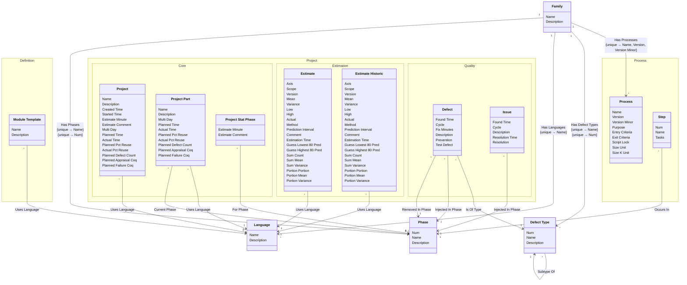

[⇦ Development](model.md) / [Process](domain-domain.process.md)

# Family

A process family and the phases, defect types, and languages that belong to it.
## Classes

The classes of this subdomain.

```mermaid
---
config:
  class:
    hideEmptyMembersBox: true
---
classDiagram
class class_domain_process_subdomain_family_class_defect_type["Defect Type"] {
        Num
        Name
        Description
    }
class class_domain_process_subdomain_family_class_family["Family"] {
        Name
        Description
    }
class class_domain_process_subdomain_family_class_language["Language"] {
        Name
        Description
    }
class class_domain_process_subdomain_family_class_phase["Phase"] {
        Num
        Name
        Description
    }
namespace Definition {
class class_domain_process_subdomain_definition_class_module_template["Module Template"] {
            Name
            Description
        }
}
namespace Process {
class class_domain_process_subdomain_process_class_process["Process"] {
            Name
            Version
            Version Minor
            Purpose
            Entry Criteria
            Exit Criteria
            Script Lock
            Size Unit
            Size K Unit
        }
class class_domain_process_subdomain_process_class_step["Step"] {
            Num
            Name
            Tasks
        }
}
namespace Project.Core {
class class_domain_project_subdomain_core_class_project["Project"] {
            Name
            Description
            Created Time
            Started Time
            Estimate Minute
            Estimate Comment
            Multi Day
            Planned Time
            Actual Time
            Planned Pct Reuse
            Actual Pct Reuse
            Planned Defect Count
            Planned Appraisal Coq
            Planned Failure Coq
        }
class class_domain_project_subdomain_core_class_project_part["Project Part"] {
            Name
            Description
            Multi Day
            Planned Time
            Actual Time
            Planned Pct Reuse
            Actual Pct Reuse
            Planned Defect Count
            Planned Appraisal Coq
            Planned Failure Coq
        }
class class_domain_project_subdomain_core_class_project_stat_phase["Project Stat Phase"] {
            Estimate Minute
            Estimate Comment
        }
}
namespace Project.Estimation {
class class_domain_project_subdomain_estimation_class_estimate["Estimate"] {
            Axis
            Scope
            Version
            Mean
            Variance
            Low
            High
            Actual
            Method
            Prediction Interval
            Comment
            Estimation Time
            Guess Lowest 80 Pred
            Guess Highest 80 Pred
            Sum Count
            Sum Mean
            Sum Variance
            Portion Portion
            Portion Mean
            Portion Variance
        }
class class_domain_project_subdomain_estimation_class_estimate_historic["Estimate Historic"] {
            Axis
            Scope
            Version
            Mean
            Variance
            Low
            High
            Actual
            Method
            Prediction Interval
            Comment
            Estimation Time
            Guess Lowest 80 Pred
            Guess Highest 80 Pred
            Sum Count
            Sum Mean
            Sum Variance
            Portion Portion
            Portion Mean
            Portion Variance
        }
}
namespace Project.Quality {
class class_domain_project_subdomain_quality_class_defect["Defect"] {
            Found Time
            Cycle
            Fix Minutes
            Description
            Prevention
            Test Defect
        }
class class_domain_project_subdomain_quality_class_issue["Issue"] {
            Found Time
            Cycle
            Description
            Resolution Time
            Resolution
        }
}
class_domain_project_subdomain_core_class_project "*" --> "1" class_domain_process_subdomain_family_class_language : Uses Language
class_domain_project_subdomain_core_class_project_part "*" --> "1" class_domain_process_subdomain_family_class_language : Uses Language
class_domain_project_subdomain_core_class_project_part "*" --> "0..1" class_domain_process_subdomain_family_class_phase : Current Phase
class_domain_project_subdomain_core_class_project_stat_phase "*" --> "1" class_domain_process_subdomain_family_class_phase : For Phase
class_domain_project_subdomain_estimation_class_estimate "*" --> "1" class_domain_process_subdomain_family_class_language : Uses Language
class_domain_project_subdomain_estimation_class_estimate_historic "*" --> "1" class_domain_process_subdomain_family_class_language : Uses Language
class_domain_project_subdomain_quality_class_defect "*" --> "1" class_domain_process_subdomain_family_class_defect_type : Is Of Type
class_domain_project_subdomain_quality_class_defect "*" --> "1" class_domain_process_subdomain_family_class_phase : Injected In Phase
class_domain_project_subdomain_quality_class_defect "*" --> "1" class_domain_process_subdomain_family_class_phase : Removed In Phase
class_domain_project_subdomain_quality_class_issue "*" --> "1" class_domain_process_subdomain_family_class_phase : Injected In Phase
class_domain_process_subdomain_definition_class_module_template "*" --> "1" class_domain_process_subdomain_family_class_language : Uses Language
class_domain_process_subdomain_family_class_family "1" --> "*" class_domain_process_subdomain_process_class_process : Has Processes<br/>{unique → Name, Version, Version Minor}
class_domain_process_subdomain_process_class_step "*" --> "1" class_domain_process_subdomain_family_class_phase : Occurs In
class_domain_process_subdomain_family_class_defect_type "*" --> "1" class_domain_process_subdomain_family_class_defect_type : Subtype Of
class_domain_process_subdomain_family_class_family "1" --> "*" class_domain_process_subdomain_family_class_defect_type : Has Defect Types<br/>{unique → Name}<br/>{unique → Num}
class_domain_process_subdomain_family_class_family "1" --> "*" class_domain_process_subdomain_family_class_language : Has Languages<br/>{unique → Name}
class_domain_process_subdomain_family_class_family "1" --> "*" class_domain_process_subdomain_family_class_phase : Has Phases<br/>{unique → Name}<br/>{unique → Num}

```

- **[Defect Type](class-domain.process.subdomain.family.class.defect_type.md).** A type of defect classified within a process family.
- **[Family](class-domain.process.subdomain.family.class.family.md).** A family is a shared group of processes, and by extention a shared group of projects that use those processes.
- **[Language](class-domain.process.subdomain.family.class.language.md).** A programming language used when estimating size or time in a process family.
- **[Phase](class-domain.process.subdomain.family.class.phase.md).** Fundamental phase skeleton for all the processes in a family.
- **[Project::Quality::Defect](class-domain.project.subdomain.quality.class.defect.md).** A defect injected and removed in projects and phases.
- **[Project::Estimation::Estimate](class-domain.project.subdomain.estimation.class.estimate.md).** An estimate of size or time, categorized by family, language, axis, and scope.
- **[Project::Estimation::Estimate Historic](class-domain.project.subdomain.estimation.class.estimate_historic.md).** A stored prior iteration of an estimate.
- **[Project::Quality::Issue](class-domain.project.subdomain.quality.class.issue.md).** An issue found in a project phase, with an optional resolution.
- **[Definition::Module Template](class-domain.process.subdomain.definition.class.module_template.md).** Shared configuration for projects (and project parts) that follow a process.
- **[Process::Process](class-domain.process.subdomain.process.class.process.md).** A versioned process to follow, owned by a family.
- **[Project::Core::Project](class-domain.project.subdomain.core.class.project.md).** Work that follows a process.
- **[Project::Core::Project Part](class-domain.project.subdomain.core.class.project_part.md).** A language-specific part of a project.
- **[Project::Core::Project Stat Phase](class-domain.project.subdomain.core.class.project_stat_phase.md).** A per-phase statistical estimate on a project. stat_phase is Phase; bucket is Stats Bucket.
- **[Process::Step](class-domain.process.subdomain.process.class.step.md).** A step of a process script.

[Model facts](subdomain-domain.process.subdomain.family-facts.md)

## Use Cases

