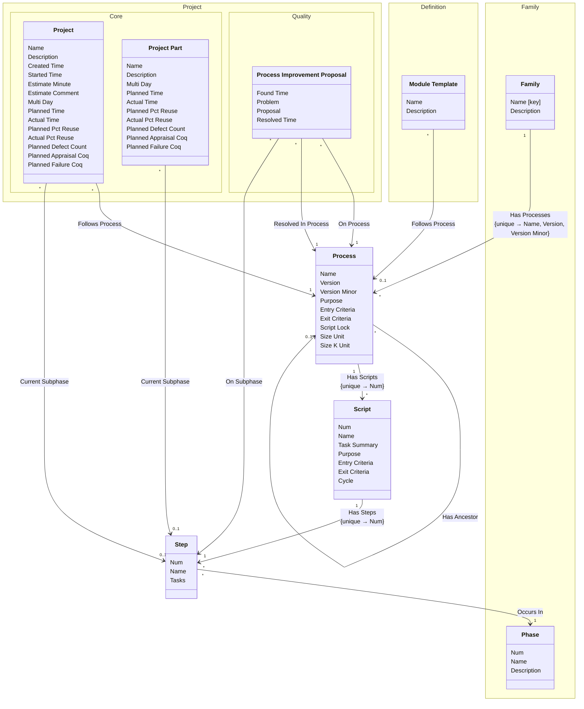

[⇦ Development Process](model.md) / [Process](domain-domain.process.md)

# Process

A versioned process: scripts and steps a family follows.
## Classes

The classes of this subdomain.

- **[Process](class-domain.process.subdomain.process.class.process.md).** A versioned process to follow, owned by a family.
- **[Script](class-domain.process.subdomain.process.class.script.md).** A step-by-step process script owned by a process.
- **[Step](class-domain.process.subdomain.process.class.step.md).** A step of a process script.
- **[Family::Family](class-domain.process.subdomain.family.class.family.md).** Core partitioning of the catalog.
- **[Definition::Module Template](class-domain.process.subdomain.definition.class.module_template.md).** Shared configuration for projects (and project parts) that follow a process.
- **[Family::Phase](class-domain.process.subdomain.family.class.phase.md).** Fundamental phase skeleton for a process family.
- **[Project::Quality::Process Improvement Proposal](class-domain.project.subdomain.quality.class.pip.md).** A process improvement proposal raised on a project.
- **[Project::Core::Project](class-domain.project.subdomain.core.class.project.md).** Work that follows a process.
- **[Project::Core::Project Part](class-domain.project.subdomain.core.class.project_part.md).** A language-specific part of a project.

[Model facts](subdomain-domain.process.subdomain.process-facts.md)

## Use Cases

