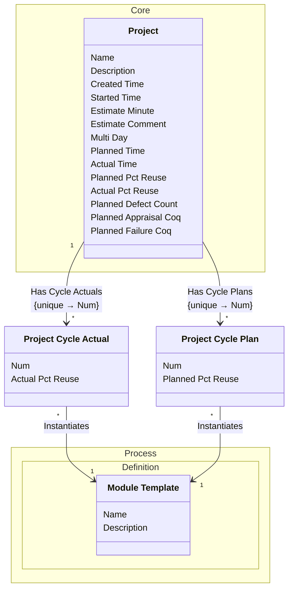

[⇦ Development Process](model.md) / [Project](domain-domain.project.md)

# Cycle

Planned and actual values recorded per project cycle.
## Classes

The classes of this subdomain.

- **[Project Cycle Actual](class-domain.project.subdomain.cycle.class.project_cycle_actual.md).** Actual recording values for one cycle of a project.
- **[Project Cycle Plan](class-domain.project.subdomain.cycle.class.project_cycle_plan.md).** Planned recording values for one cycle of a project.
- **[Process::Definition::Module Template](class-domain.process.subdomain.definition.class.module_template.md).** Shared configuration for projects (and project parts) that follow a process.
- **[Core::Project](class-domain.project.subdomain.core.class.project.md).** Work that follows a process.

[Model facts](subdomain-domain.project.subdomain.cycle-facts.md)

## Use Cases

