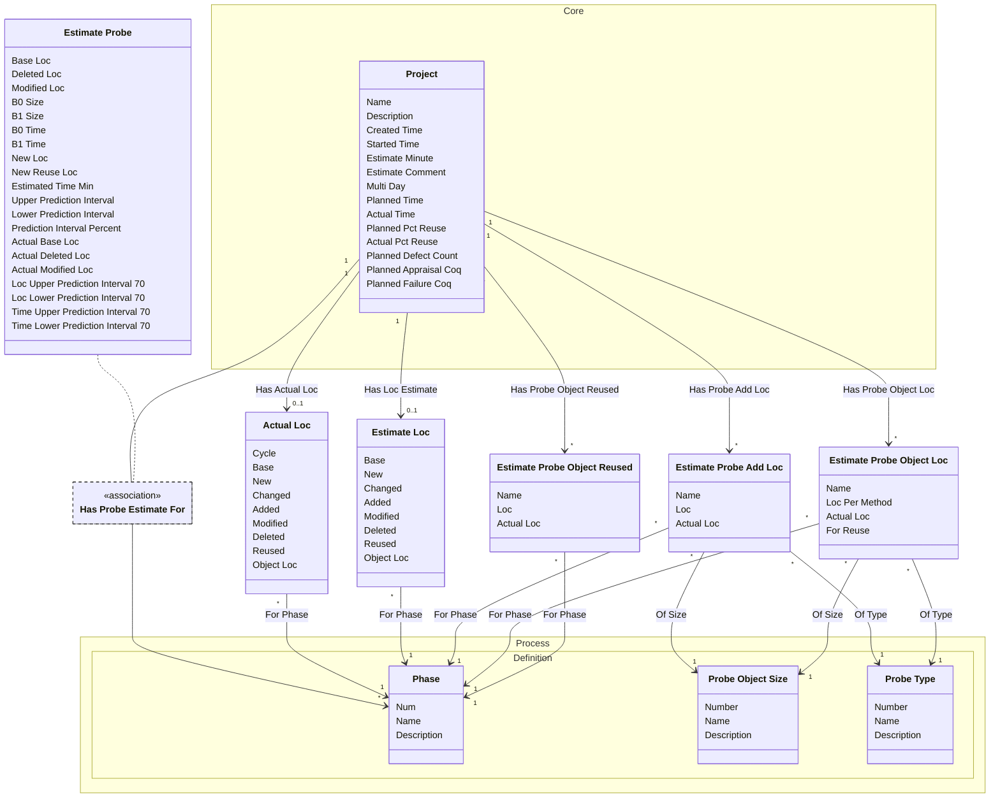

[⇦ Development Process](model.md) / [Project](domain-domain.project.md)

# Estimation

Lines-of-code accounts and PROBE calculations recorded on a running project.
## Classes

The classes of this subdomain.

- **[Actual Loc](class-domain.project.subdomain.estimation.class.actual_loc.md).** Actual lines-of-code account for a project.
- **[Estimate Loc](class-domain.project.subdomain.estimation.class.estimate_loc.md).** Planned lines-of-code account for a project.
- **[Estimate Probe](class-domain.project.subdomain.estimation.class.estimate_probe.md).** PROBE size and time calculation for a project in a phase.
- **[Estimate Probe Add Loc](class-domain.project.subdomain.estimation.class.estimate_probe_add_loc.md).** An added-object line in a PROBE size estimate.
- **[Estimate Probe Object Loc](class-domain.project.subdomain.estimation.class.estimate_probe_object_loc.md).** A new-object line in a PROBE size estimate.
- **[Estimate Probe Object Reused](class-domain.project.subdomain.estimation.class.estimate_probe_object_reused.md).** A reused-object line in a PROBE size estimate.
- **[Process::Definition::Phase](class-domain.process.subdomain.definition.class.phase.md).** Fundamental phase skeleton for a process family.
- **[Process::Definition::Probe Object Size](class-domain.process.subdomain.definition.class.probe_object_size.md).** A relative size category used when estimating objects with PROBE.
- **[Process::Definition::Probe Type](class-domain.process.subdomain.definition.class.probe_type.md).** A PROBE object-type category used when listing added and new objects.
- **[Core::Project](class-domain.project.subdomain.core.class.project.md).** Work that follows a process.

[Model facts](subdomain-domain.project.subdomain.estimation-facts.md)

## Use Cases

