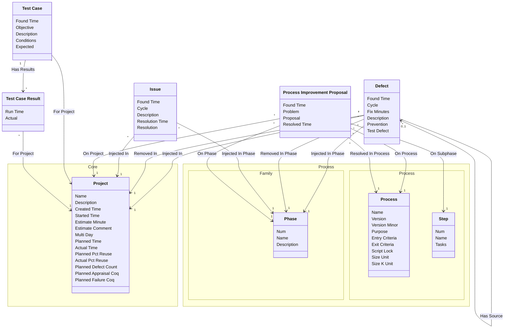

[⇦ Development](model.md) / [Project](domain-domain.project.md)

# Quality

Defects, issues, process improvement proposals, and test cases recorded against projects.
## Classes

The classes of this subdomain.

- **[Defect](class-domain.project.subdomain.quality.class.defect.md).** A defect injected and removed in projects and phases.
- **[Issue](class-domain.project.subdomain.quality.class.issue.md).** An issue found in a project phase, with an optional resolution.
- **[Process Improvement Proposal](class-domain.project.subdomain.quality.class.pip.md).** A process improvement proposal raised on a project.
- **[Test Case](class-domain.project.subdomain.quality.class.test_case.md).** A test case defined for a project.
- **[Test Case Result](class-domain.project.subdomain.quality.class.test_case_result.md).** A recorded run of a test case.
- **[Process::Family::Phase](class-domain.process.subdomain.family.class.phase.md).** Fundamental phase skeleton for all the processes in a family.
- **[Process::Process::Process](class-domain.process.subdomain.process.class.process.md).** A versioned process to follow, owned by a family.
- **[Core::Project](class-domain.project.subdomain.core.class.project.md).** Work that follows a process.
- **[Process::Process::Step](class-domain.process.subdomain.process.class.step.md).** A step of a process script.

[Model facts](subdomain-domain.project.subdomain.quality-facts.md)

## Use Cases

