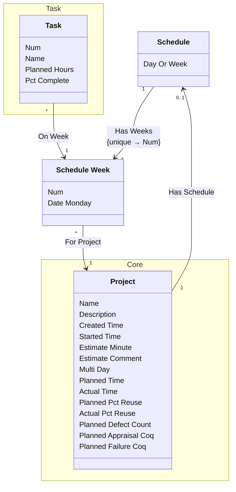

[⇦ Development](model.md) / [Project](domain-domain.project.md)

# Schedule

The planned calendar for a project, in days or weeks.
## Classes

The classes of this subdomain.

- **[Schedule](class-domain.project.subdomain.schedule.class.schedule.md).** The planned calendar for a project, in days or weeks.
- **[Schedule Week](class-domain.project.subdomain.schedule.class.schedule_week.md).** One week (or day slot) on a project schedule.
- **[Core::Project](class-domain.project.subdomain.core.class.project.md).** Work that follows a process.
- **[Task::Task](class-domain.project.subdomain.task.class.task.md).** A planned task on a project, assigned to a phase and a schedule week.

[Model facts](subdomain-domain.project.subdomain.schedule-facts.md)

## Use Cases

