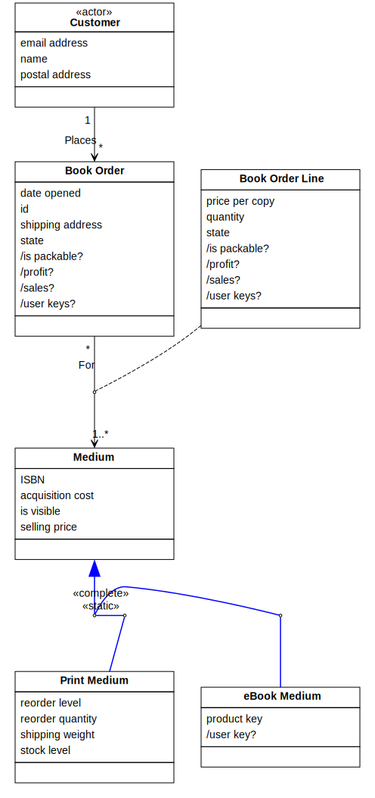
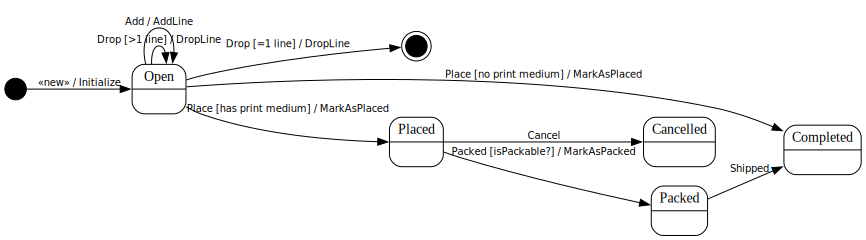

[⇦ Order Fulfillment](domain-01_order_fulfillment.md)

# Book Order

A Book Order represents a Customer's request for a specified set (and quantity) of books.

## Attributes

| Name | Rules | Nullable | Comment |
| ---- | ----- | -------- | ------- |
| date opened | calendar date no earlier than Janurary 1, 1998, and no later than today, to the nearest whole day   | false | The date this Book Order was created, this is, the first Book Order Line was added. |
| id | refer to Corporate Policy CP123a, "Customer Order Identification"   | false | The identifier (key) of the Book order. This used to be outside Order Fullfillment to correlate Books Orders with external business processes. |
| shipping address | any mailing address acceptable to the US Post Office ro Canada Post   | false | The postal address the Customer is requesting any Print Media in the Book order be shipped to. |
| /is packable? |   true only when .state == placed and IsPackable? == true for each Line in this order (via For) | false | Shows if this Book Order is currently packable or not. |
| /profit? |   if .state == completed then sum of profit? for each Line (via For) otherwise $0.00 | false | Shows the amount of profit generated by this Book Order. |
| /sales? |   if .state == completed then sum of sales? for each Line (via For) otherwise $0.00 | false | Shows the total dollar sales amount of this Book Order. |
| /user keys? |   if .state is not opened or cancelled then set of user key? from all Lines in this Order (via For) otherwise empty set | false | provides user keys for eBook Media in this Book Order. |

## Relations

# State Machine

## State and Event Descriptions

The states for this class.

- **Cancelled.** The order has been cancelled.
- **Completed.** The order is shipped.
- **Open.** The order is created.
- **Packed.** The order is boxed and ready to ship.
- **Placed.** This order is in process.

The events for this class.

- **Add.** Add a line to the Book Order. Parameters:
   - *medium.* somewhere
   - *qty.* somewhere

- **Cancel.** Cancel the Book Order.
- **Drop.** Remove a line from the Book Order. Parameters:
   - *book order line.* somewhere

- **Packed.** The Book Order is ready to ship.
- **Place.** Purchase the the Book Order. Parameters:
   - *address.* somewhere

- **Shipped.** The Book Order has left the warehouse.
- **«new».** Create this Book Order. Parameters:
   - *address.* somewhere

## Action Specifications

The actions for this class.

### AddLine(medium, qty)

Add an item to a Book Order.

Requires:

- qty is consistent with the range of Book Order Line .quantity

Guarantees:

- one new Book Order Line (this Book Order, medium, qty) has been created

Triggered from:

- Add(medium, qty)

### DropLine(book order line)

Remove a line from a book order.

Requires:

- book order line exists in the Book Order via For

Guarantees:

- referenced book order line has been deleted via For

Triggered from:

- Drop(book order line) [>1 line]
- Drop(book order line) [=1 line]

### Initialize(address)

Start a new Book Order.

Requires:

- address is consistent with the range of .shipping addresss

Guarantees:

- one new Book Order exists with:
    - .id properly assigned,
    - .date opened == today,
    - .shipping address == address

Triggered from:

- «new»(address)

### MarkAsPacked()

physical medium is all packed for shipping

Requires:

*None*

Guarantees:

- packed has been signaled for each line in the order via For

Triggered from:

- Packed() [isPackable?]

### MarkAsPlaced(address)

This book order has been made is is ready for delivery whether electronic or physical.

Requires:

- address is consistent with the range of .shipping address

Guarantees:

- .shipping address == address and place has been signaled for each line in the order via For

Triggered from:

- Place(address) [has print medium]
- Place(address) [no print medium]

