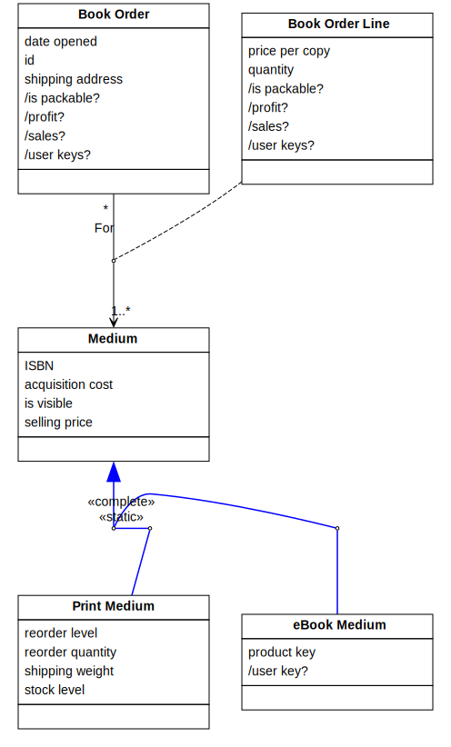
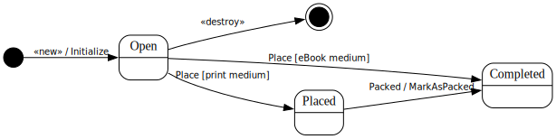

[⇦ Order Fulfillment](domain-01_order_fulfillment.md)

# Book Order Line

A Book Order Line is the request, within a Book Order, for a specific number of copies of a selected Medium.
This may also be referred to as a "Book Order Details" in some organizations.

## Attributes

| Name | Rules | Nullable | Comment |
| ---- | ----- | -------- | ------- |
| price per copy | $0.00 .. unconstrained in US Dollars, to the whole cent   | false | The price of the selected Medium when it was added to this Book Order. This is how much the customer will be/was charaged when the Book Order is/was paid for. This allows WebBooks to change the price of Media yet still be able to correctly calculate order-level profit. Sometimes, Media may be offered for free. |
| quantity | 1 .. unconstrained, to the whole number   | false | The number of copies of the selected Medium being requested. |
| /is packable? |   Always true if this line refers to eBook medium. If this line refers to print medium, true only when .quantity <= Print Medium .stock level | false | Shows if this Book Order Line is currently packable or not. |
| /profit? |   .quantity * (.price per copy - Medium.acquisition cost) via For | false | Shows the amount of profit generated by this Book Order Line. |
| /sales? |   .quantity * .price per copy | false | Shows the total dollar amount of this Book Order Line. |
| /user keys? |   when linked to eBook medium then eBook.Medium.user key? via For, otherwise nothing. | false | Shows the user key a Custoemr needs to unlock an eBook on their reader. |

## Relations

# State Machine

## State and Event Descriptions

The states for this class.

- **Completed.** The book order line is shipped, or handed off to customer as eBook.
- **Open.** The book order line is created.
- **Placed.** A physical medium book is ready for packing.

The events for this class.

- **Completed.** No more work needed on this Book Order Line.
- **Packed.** The Book Order Line is ready to ship.
- **Place.** Purchase the the Book Order Line.
- **«destroy».** Remove this book order line.
- **«new».** Create this Book Order Line. Parameters:
   - *book order.* somewhere
   - *medium.* somewhere
   - *quantity.* somewhere

## Action Specifications

The actions for this class.

### Initialize(book order, medium, quantity)

Start a new Book Order Line.

Requires:

- qty in reange of .quantity

Guarantees:

- one new Book Order Line exists with:
    - .quanity == qty,
    - .price per copy == Medium.selling price,
    - this line is linked to its Book Order and Medium

Triggered from:

- «new»(book order, medium, quantity)

### MarkAsPacked()

physical medium is all packed for shipping

Requires:

*None*

Guarantees:

- if linked to Print Medium then picked(.quantity) has been signaled for it

Triggered from:

- Packed()

