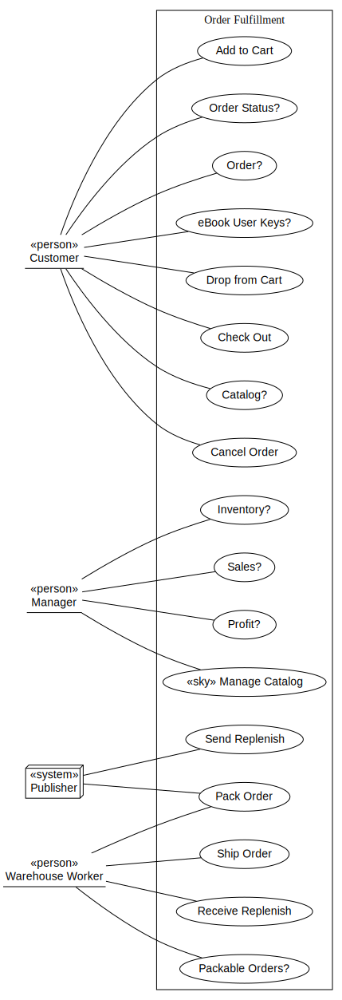
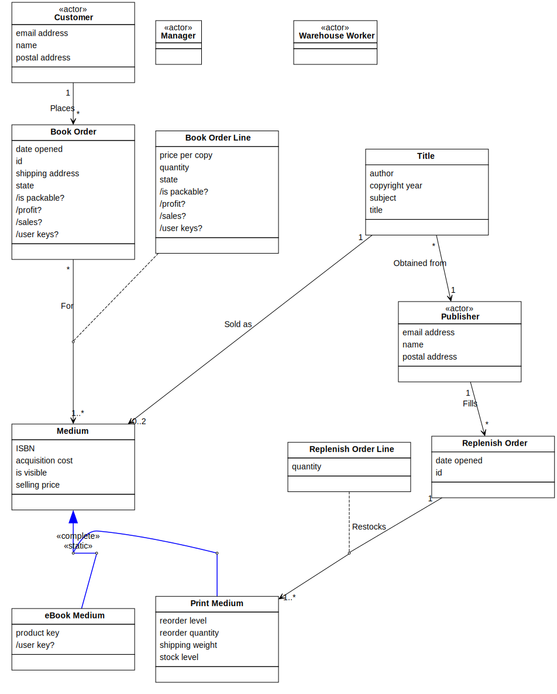

[⇦ WebBooks 2.0](model.md)

# Order Fulfillment

This domain is in charge of the catalog, inventory, customers orering, shipping and receiving.

Concepts in this domain include:

- Customer
- Add to cart
- Procede to checkout
- Order
- Packability
- Packing
- Shipping
- Stock on hand
- Replenish

## Use Cases

- **[Add to Cart](use_case-01_order_fulfillment.add_to_cart.md).** In this use case, the Customer is adding one to many copies 
of the same Medium to their shopping cart.
- **[Cancel Order](use_case-01_order_fulfillment.cancel_order.md).** ... details ...
- **[Catalog?](use_case-01_order_fulfillment.catalog.md).** This use case provides a Customer with the ability to browse the catalog:
visibility into Titles, Media, and their availability for ordering.
- **[Check Out](use_case-01_order_fulfillment.check_out.md).** ... details ...
- **[Drop from Cart](use_case-01_order_fulfillment.drop_from_cart.md).** The Customer is removing a previously added Medium from their shopping cart.
- **[eBook User Keys?](use_case-01_order_fulfillment.ebook_user_keys.md).** ... details ...
- **[Inventory?](use_case-01_order_fulfillment.inventory.md).** ... details ...
- **[«sky» Manage Catalog](use_case-01_order_fulfillment.manage_catalog.md).** ... details ...
- **[Order?](use_case-01_order_fulfillment.order.md).** ... details ...
- **[Order Status?](use_case-01_order_fulfillment.order_status.md).** ... details ...
- **[Packable Orders?](use_case-01_order_fulfillment.packable_orders.md).** ... details ...
- **[Pack Order](use_case-01_order_fulfillment.pack_order.md).** ... details ...
- **[Profit?](use_case-01_order_fulfillment.profit.md).** ... details ...
- **[Receive Replenish](use_case-01_order_fulfillment.receive_replenish.md).** ... details ...
- **[Sales?](use_case-01_order_fulfillment.sales.md).** ... details ...
- **[Send Replenish](use_case-01_order_fulfillment.send_replenish.md).** ... details ...
- **[Ship Order](use_case-01_order_fulfillment.ship_order.md).** ... details ...

## Classes

The classes of this domain.

- **[Book Order](class-01_order_fulfillment.book_order.md).** A Book Order represents a Customer's request for a specified set (and quantity) of books.
- **[Book Order Line](class-01_order_fulfillment.book_order_line.md).** A Book Order Line is the request, within a Book Order, for a specific number of copies of a selected Medium.
- **[«actor» Customer](class-01_order_fulfillment.customer.md).** This class is an actor that represent persons or businesses that may place Book Orders with WebBooks.
- **[«actor» Manager](class-01_order_fulfillment.manager.md).** This class is an actor representing WebBooks employees who have the authority 
to maintain the catalog of for-sale books, establish and modify pricing, and view 
financial summary data.
- **[Medium](class-01_order_fulfillment.medium.md).** This class repressents the different forms in which Titles are available for sale.
- **[Print Medium](class-01_order_fulfillment.medium_print.md).** This class represents as specific Title being offered for sale to Customers in print (aka "physical book," or paper) format.
- **[«actor» Publisher](class-01_order_fulfillment.publisher.md).** This is an actor that represents external companies who publish and distribute books that WebBooks sells.
- **[Replenish Order](class-01_order_fulfillment.replenish_order.md).** This represents a request by WebBooks to a given
Publisher to obtain more physical copies of a specified set of Print Media.
- **[Replenish Order Line](class-01_order_fulfillment.replenish_order_line.md).** This is a request, within a specific Replenish Order, for a specified number of copies of some 
specified Print Medium.
- **[Title](class-01_order_fulfillment.title.md).** This class represents a specdific book being available for sale to Customers, either
in eBook or Print format, or both.
- **[«actor» Warehouse Worker](class-01_order_fulfillment.warehouse_worker.md).** This class is an actor representing WebBooks employees who have the responsibility 
to pack and ship Book Orders involving Print media.
- **[eBook Medium](class-01_order_fulfillment.medium_ebook.md).** This class represents a specific Title being offered for sale to Customers in eBook (i.e.

