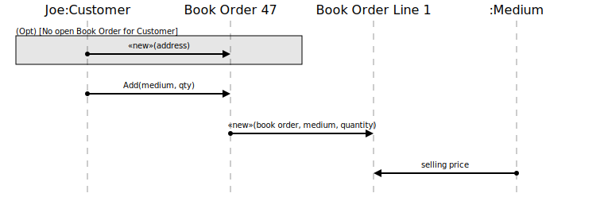

[⇦ Order Fulfillment](domain-01_order_fulfillment.md)

# Add to Cart

In this use case, the Customer is adding one to many copies 
of the same Medium to their shopping cart. If no open 
Book Order exists for this Customer, a new Book Order is created.

## Scenarios

Detailed explorations of this use case.

### Simple

The basic flow for adding to a cart.

