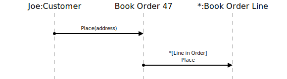

[⇦ Order Fulfillment](domain-01_order_fulfillment.md)

# Check Out

The Customer has decided to proceed to checkout (i.e. place their Book Order).

## Scenarios

Flows of interest.

### Simple

Purchasing the book order.

