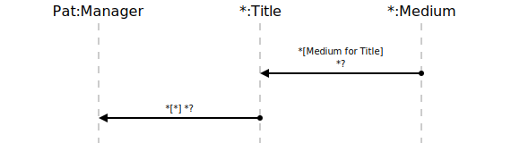

[⇦ Order Fulfillment](domain-01_order_fulfillment.md)

# Inventory?

This use case gives Managers visibility into the status of Inventory: available 
Titles, current stock levels, and reorder levels.

## Scenarios

Flows of interest.

### Inventory

Manager queries the inventory.

