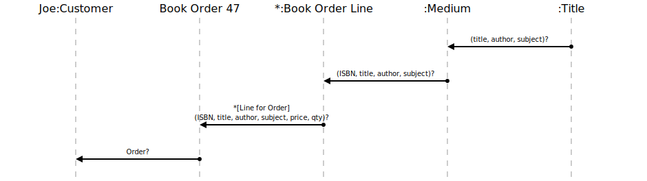

[⇦ Order Fulfillment](domain-01_order_fulfillment.md)

# Order?

This use case gives the Custoemr visibility into the contents of one of their Book Orders.

## Scenarios

Flows of interest.

### Simple

Details about an order.

