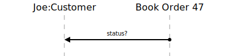

[⇦ Order Fulfillment](domain-01_order_fulfillment.md)

# Order Status?

This use case gives the Customer visibility into the status of one of their Book 
Orders.

## Scenarios

Flows of interest.

### Simple

Customer asks where this order is in its process.

