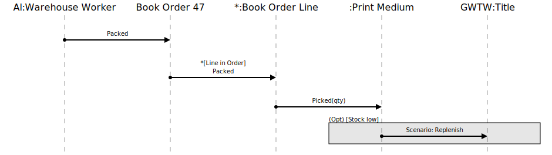
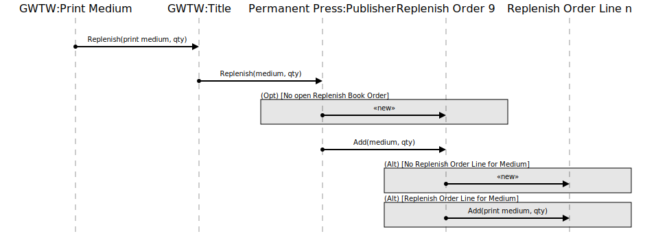

[⇦ Order Fulfillment](domain-01_order_fulfillment.md)

# Pack Order

A Book Order involving Print Media has been packed by a Warehouse Worker;
stock needs to be decreased by the number of copies packed.

## Scenarios

Flows of interest.

### Pack Order

Order ready for shipping. GWTW is Gone With The Wind.
This is the first part of the scenario. If stock goes
(or already is) low on one or more Print Media, the 
Replenish scenario triggers.

### Replenish

A Book Order involving Print Media got packed adn stock went 
(or already was) low on one or more Print Media, triggering 
the need to replenish stock. This is the second part of the 
Pack Order sequence diagram.

