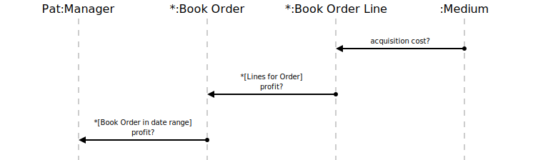

[⇦ Order Fulfillment](domain-01_order_fulfillment.md)

# Profit?

This use case gives Managers visibility into profit results over some period of time.

## Scenarios

Flows of interest.

### Profit

Manager queries the profits.

