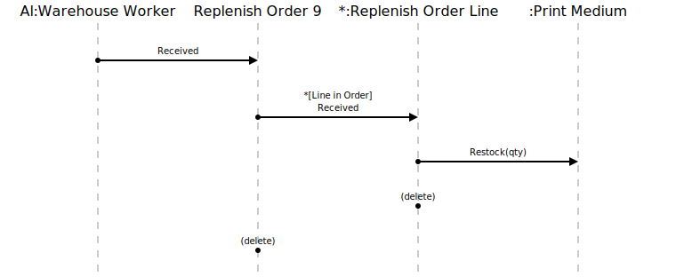

[⇦ Order Fulfillment](domain-01_order_fulfillment.md)

# Receive Replenish

A Replenish Order for Print Media was received from the Publisher; Print Media 
stock needs to be increased to reflect the number of copies received.

## Scenarios

Flows of interest.

### Receive Repenish

Order ready for shipping. GWTW is Gone With The Wind.
This is the first part of the scenario. If stock goes
(or already is) low on one or more Print Media, the 
Replenish scenario triggers.

