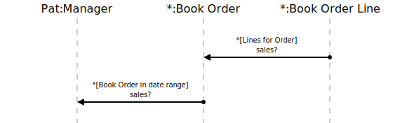

[⇦ Order Fulfillment](domain-01_order_fulfillment.md)

# Sales?

This use case gives Managers visibility into sales results over some period of time.

## Scenarios

Flows of interest.

### Sales

Manager queries the sales numbers.

