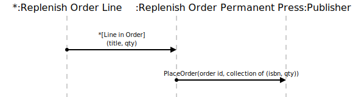

[⇦ Order Fulfillment](domain-01_order_fulfillment.md)

# Send Replenish

The wait time (24 hours) has passed after a Replenish Order was opened, and the 
contents of the order need to be sent to the Publisher.

## Scenarios

Flows of interest.

### Send Repenish

Inform the Publisher that restocks are needed.

