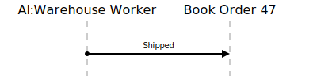

[⇦ Order Fulfillment](domain-01_order_fulfillment.md)

# Ship Order

A Book Order (with Print Media) was previously packed and has been taken by a shipper 
for delivery to the Customer.

## Scenarios

Flows of interest.

### Ship Order

A shipper has picked up the order.

